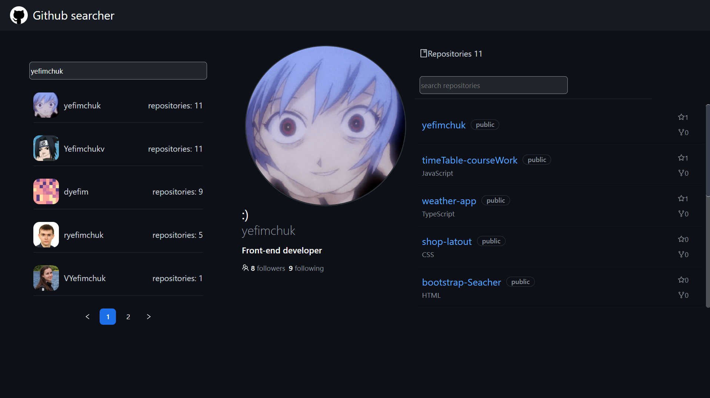

# Github searcher


#### Tech Used

-  React 
-  AntDesign
-  Redux-toolkit
-  Axios
-  GitHubAPI

## The UI




#### API
- Used github API - https://docs.github.com/en/rest 
- baseURL = https://api.github.com/ 


## How To Run The Application

#### Step 1: 
- Clone the repo
- Open it in your favorite editor
- Open a terminal in your editor and run `yarn install` or `npm install`

#### Step 2: 
- Head over to https://github.com/settings/tokens to get an access token. (Guide how get token https://docs.github.com/en/authentication/keeping-your-account-and-data-secure/creating-a-personal-access-token)
- Create a `.env` file in the root folder and put your keys in the file like this: 

```
REACT_APP_ACCESS_TOKEN=YourGitHubAccessToken
```

#### Step 3: 

- In your terminal run `yarn start` or `npm start`. 

## Dependencies 

```json
"dependencies": {
    "@ant-design/icons": "^4.7.0",
    "@reduxjs/toolkit": "^1.8.2",
    "@testing-library/jest-dom": "^5.14.1",
    "@testing-library/react": "^13.0.0",
    "@testing-library/user-event": "^13.2.1",
    "@types/jest": "^27.0.1",
    "@types/node": "^16.7.13",
    "@types/react": "^18.0.0",
    "@types/react-dom": "^18.0.0",
    "antd": "^4.20.6",
    "axios": "^0.27.2",
    "dart-sass": "^1.25.0",
    "lodash.debounce": "^4.0.8",
    "react": "^18.1.0",
    "react-content-loader": "^6.2.0",
    "react-dom": "^18.1.0",
    "react-redux": "^8.0.2",
    "react-router-dom": "^6.3.0",
    "react-scripts": "5.0.1",
    "sass": "^1.52.1",
    "typescript": "^4.4.2",
    "web-vitals": "^2.1.0"
  },
  
  ```
